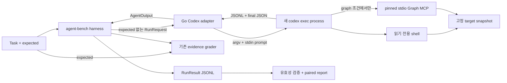

# Codex adapter 설계

상태: 제안. 구현 계약은 [spec.md](spec.md)를 따른다.

## 데이터 흐름

MCP 수명주기는 Codex가 관리하고 adapter가 최상위 process group과 deadline을 관리한다. 종료 시 자식이 남는지 확인한다. adapter의 stdout은 단일 protocol JSON이며 diagnostic과 raw event는 별도 파일 또는 stderr에 기록한다.

## parser 구성

stream reader는 이벤트 원문을 보존하면서 item id별 최종 상태를 갱신한다. command 실행과 MCP 실행은 시작·완료 이벤트를 함께 받아도 한 번만 센다. JSONL의 임의 마지막 `agent_message`를 답으로 채택하지 않고 `output-last-message`의 strict JSON과 일치시키며 terminal turn 상태를 검사한다.

usage, 실행 성공, 과제 점수, 실험 조건 충족을 별도로 계산한다. warning item이 있더라도 정상 terminal turn은 가능하다. 반대로 terminal turn이 성공해도 Graph가 승인 거절로 실행되지 않았다면 연결 smoke는 실패다. 모델의 정상적인 Graph 미선택과 인프라상 사용 불가능은 서로 다른 상태다.

이번 이벤트의 MCP 결과는 `structured_content`에 있었고 `content=[]`였다. parser fixture는 두 형태와 오류 응답을 모두 포함한다. Graph의 `escape`는 성공한 tool execution일 수 있으나 graph fact 조회 성공으로 계산하지 않는다.

## 환경과 비교 manifest

common manifest는 모델 선택, effort/tier, 인증 방식, CLI 버전/hash, 공통 prompt template, schema, shell policy, target, timeout을 포함한다. strategy manifest는 Graph server/tool schema/설명/승인 설정을 별도로 포함한다. baseline과 graph의 전체 argv hash가 다르다는 이유만으로 비교를 막지 않는다. 비교할 공통 필드와 의도된 차이를 구조적으로 구분한다.

정식 도입 전 전역 skill/context 통제를 검증한다. preflight만으로 보장할 수 없는 값은 unknown으로 기록한다. raw event에서 actual model이 없을 때 requested model을 복사하여 관측값처럼 저장하지 않는다.

## 변경 위치 제안

| 위치 | 역할 |
| --- | --- |
| `cmd/codex-adapter` | 환경/인자 설정, stdin/out 진입점 |
| `internal/codexadapter` | process, stream parser, strict final output, MCP config |
| `internal/domain` | 출처·상태·추가 도구 metric의 호환 확장 |
| `internal/report` | effort/config 등 비교 조건, 상태·제외 이유 표시 |
| `scripts/run-codex-comparison.sh` | 순서 교차, experiment 생성, 실패 보존 |
| `docs/005-codex-adapter` | 이 명세·설계·runbook·tasks를 저장할 repository 위치 |

초기 CI는 fixture 기반 테스트만 실행한다. 실제 ChatGPT 로그인 smoke는 사용자 로컬 환경에서 수행한다. adapter 추가와 별개인 grader 개선, OrcaRouter quota 정책, provider 간 순위는 별도 범위로 둔다.
