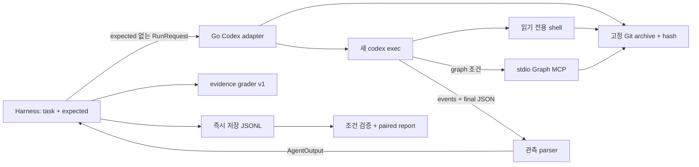

# Codex adapter 설계

구현 계약은 [spec.md](spec.md), 운영은 [runbook.md](runbook.md)를 따른다.

## 데이터 흐름

## 모듈 책임

| 파일/패키지 | 책임 |
| --- | --- |
| cmd/codex-adapter | stdin/stdout 계약, signal 취소 |
| internal/codexadapter/config.go | 환경 검증, 고정 argv와 MCP 설정 |
| internal/codexadapter/snapshot.go | Git archive, 경로 제한, target/환경 hash |
| internal/codexadapter/adapter.go | preflight, artifact, 단일 bounded 실행, final 일치 검증 |
| internal/codexadapter/stream.go | item dedup, usage, status, Graph 근거 관측 |
| internal/codexadapter/process_unix.go | process group 종료와 reap |
| internal/runner | 결과·상태 전달, fatal 계정 오류 중단 |
| internal/report | 비교 조건, 성공 분모, recall/cache/provenance/제외 이유 |
| scripts/run-codex-comparison.sh | 교차 순서, 독립 artifact 경로, 실패 보존 |

execution 완료와 measurement 유효성은 별개다. MCP가 거절된 후 파일 탐색으로 답변을 만들면 execution=completed, measurement=invalid다. 정상 제공된 Graph를 모델이 사용하지 않은 결과는 availability 비교에서 유지한다.

## 결과의 출처

공통 hash에는 모델 실행 argv, 연결 smoke 정책과 외부 시간 예산이 들어간다. Graph 추가 prompt/도구 등록은 전략 차이로 취급한다. 별도 필드로 CLI, prompt template/schema, graph binary/JS, target와 host context 정보를 비교한다. artifact의 임시 절대경로는 공통 hash에 넣지 않는다.

ChatGPT 인증은 CLI 자체가 처리한다. adapter는 credential 파일을 읽지 않는다. model은 JSONL에서 관측되지 않아 채우지 않으며 requested_only로 표시한다. 금액도 계산하지 않는다.

## 수명주기와 제한

adapter가 Codex process group을 만들고 timeout 시 종료 후 Wait한다. harness는 adapter에 먼저 TERM을 보내 partial 출력을 기다린다. nested timeout과 자식 종료는 실제 subprocess fixture로 검증한다.

source와 실행 target을 분리하지만 read-only sandbox가 모든 외부 읽기를 차단하지는 않는다. user context fingerprint도 완전 격리의 대체물이 아니다. 이 제약을 결과와 문서에 함께 남기고, 다음 단계는 [roadmap](roadmap.md)을 따른다.
